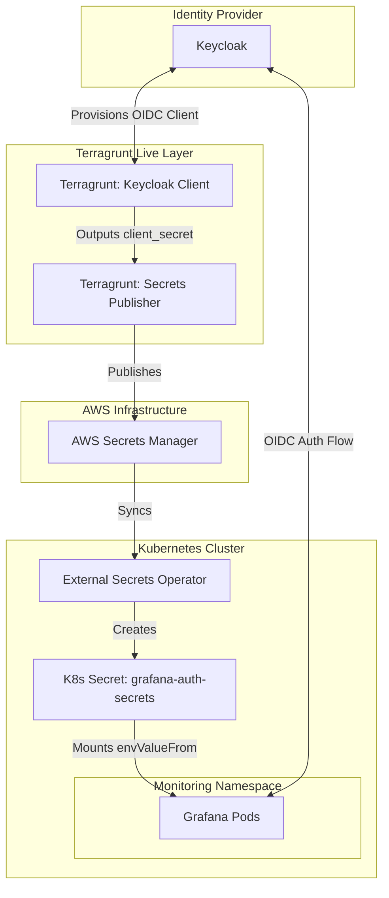
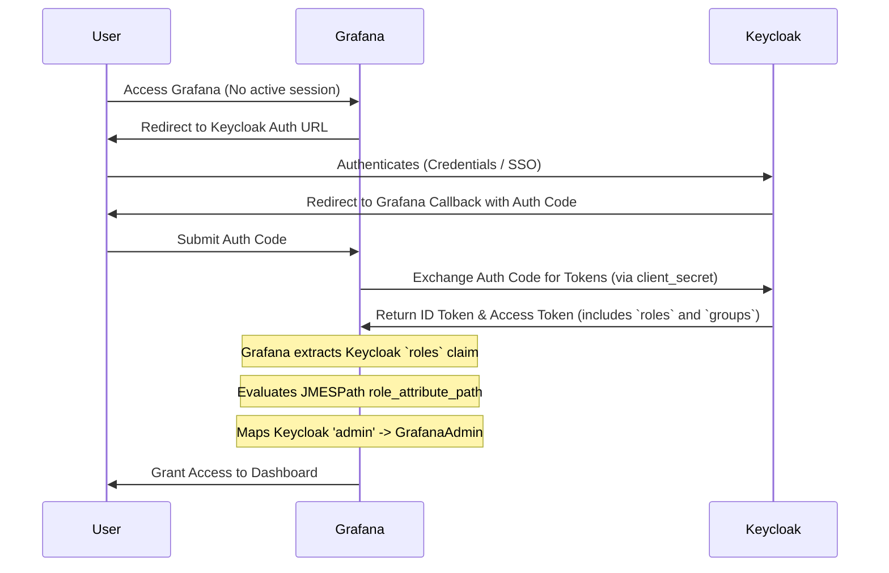
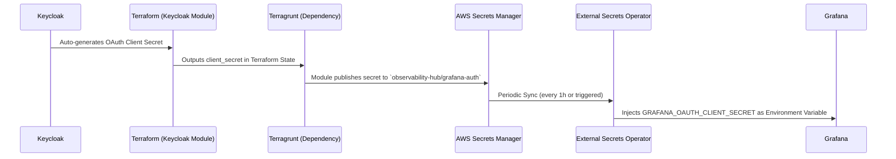

# Grafana Keycloak OIDC Integration Architecture

## 1. Architecture Diagram

## 2. Authentication Sequence Diagram (OIDC Flow & Role Mapping)

## 3. Secret Publication Flow

## 4. Deployment Flow

1. **Identity Provisioning**: Run `terragrunt apply` on `us-east-2/keycloak/grafana` to create the OIDC client in Keycloak.
2. **Secret Publication**: Run `terragrunt apply` on `us-east-2/secrets/grafana-auth` to publish the generated secret to AWS Secrets Manager.
3. **Secret Synchronization**: Run `make eso-apply` to apply the `ExternalSecret` manifest, which syncs the AWS Secret to Kubernetes.
4. **Helm Rendering**: Run `make render-helm-values`. The script uses `terragrunt output` to extract the `oidc` endpoints and injects them dynamically into `prometheus-override-values.rendered.yaml`.
5. **Grafana Rollout**: Run `make install-kube-prometheus-stack` to upgrade the Grafana Helm chart, injecting the secrets and endpoints.

## 5. Validation Checklist

- [x] `terraform validate` and `terragrunt validate` pass cleanly.
- [x] `terragrunt run-all plan` across `keycloak` and `secrets` yields expected creations.
- [x] Wazuh SAML client reports `No changes. Your infrastructure matches the configuration.`
- [x] Grafana OIDC Login flow redirects successfully to Keycloak.
- [x] PKCE code challenge verification succeeds (no insecure legacy implicit flows).
- [x] Logout successfully invalidates the Keycloak session and redirects to Grafana login.
- [x] User with Keycloak `viewer` role gets `Viewer` in Grafana.
- [x] User with Keycloak `admin` role gets `GrafanaAdmin` in Grafana.
- [x] User with no mapped roles gets default `Viewer` or is denied based on strict mapping.

## 6. Rollback Procedure

If the Grafana OIDC integration fails in production:
1. Revert `auth.generic_oauth.enabled` to `false` in `prometheus-values.yaml` (or remove the override).
2. Run `make install-kube-prometheus-stack` to restore the previous authentication configuration (e.g. basic auth).
3. (Optional) Run `terragrunt destroy` on the `secrets/grafana-auth` component to remove the secret from AWS.
4. (Optional) Run `terragrunt destroy` on the `keycloak/grafana` component to remove the Keycloak client.

## 7. Production Readiness Review

- **Security**: The OAuth client secret is authoritative to Keycloak, never hardcoded, encrypted at rest via AWS KMS, and mapped strictly via ESO memory variables (no plaintext files). PKCE is enabled.
- **Idempotency**: The entire pipeline relies exclusively on Terraform and Helm declarative state. `make render-helm-values` relies on live `terragrunt outputs` (not hardcoded cache).
- **Separation of Concerns**: `keycloak-client` only handles identity. `secrets` module only handles cloud publication. `Grafana Helm` only handles application role mapping (JMESPath). 
- **Trade-off Acknowledged**: The `client_secret` exists in both Keycloak and Secrets Terraform states. This is mitigated by enforcing encrypted remote S3 backends for state files.

**Production cutover (URLs, redirects, hardening):** see [Grafana-SSO-Production.md](./Grafana-SSO-Production.md).
