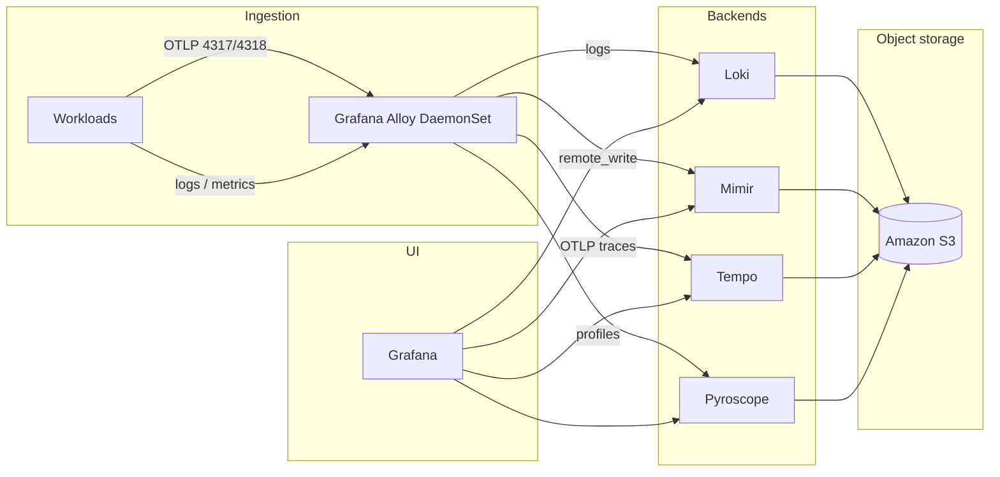

<div align="center"> 
  <h1>🚀 LGTM stack on Kubernetes Complete Hands‑On Guides 🌟 </h1>
  <a href="https://github.com/kioskOG/observability-hub"> </a>  
  <br>
    
  
  
  
  
  
  

  <!--  -->
  <a href="https://github.com/kioskOG/observability-hub/blob/main/LICENSE">  </a>
  <a href="https://github.com/kioskOG/observability-hub/graphs/contributors">  </a>
  <a href="https://github.com/kioskOG/observability-hub/issues">   </a>
  <a href="https://github.com/kioskOG/observability-hub/pulls">  </a>
  <a href="https://github.com/kioskOG/observability-hub/pulls">  </a>
  </div>

---


# Observability Hub

Helm values, Kubernetes manifests, and a **Makefile** to run a Grafana-style observability stack on Kubernetes (especially **AWS EKS**): **Loki** (logs), **Mimir** (metrics), **Tempo** (traces), **Grafana Alloy** (collection, OTLP, profiles), **Pyroscope** (continuous profiling), **kube-prometheus-stack** (Prometheus Operator, Grafana, Alertmanager), and **Blackbox Exporter**.

This repository is oriented around **repeatable installs**, **S3-backed** Loki/Mimir/Tempo/Pyroscope, **basic auth** on Loki and Mimir gateways, and **multi-tenant Loki** (`auth_enabled` + per-tenant `X-Scope-OrgID`).

---

## Architecture



---

## Repository layout

| Path | Purpose |
|------|---------|
| `Makefile` | Install order, `init`, Terragrunt AWS targets, Helm installs; resolves **CLUSTER_NAME / REGION** via env → kubectl → aws (`scripts/resolve-cluster-env.sh`) |
| `scripts/resolve-cluster-env.sh` | Shared cluster/region resolver used by Make and seed scripts |
| `terragrunt/` | Terraform modules + live stacks (observability S3/IRSA, plus existing platform stacks) |
| `loki/` | Loki Helm overrides, IAM policy/trust examples |
| `mimir/` | Mimir overrides, rules, dashboards |
| `tempo/` | Tempo overrides, trace demo app, optional templates |
| `alloy/` | Alloy Helm overrides (River config in `alloy-override-values.yaml`; Faro RUM on `:12347`) |
| `beyla/` | Grafana Beyla eBPF auto-instrumentation → Alloy OTLP |
| `faro/` | Faro Web SDK example page for browser RUM |
| `external-secrets/` | ClusterSecretStore + ExternalSecrets + `seed-aws-secrets.sh` (AWS Secrets Manager) |
| `pyroscope/` | Pyroscope overrides, sample apps, IAM examples |
| `kube-prometheus-stack/` | Local chart / values for Prometheus Operator + Grafana |
| `blackbox-exporter/` | Blackbox values |
| `short-url-application/` | Example app with metrics + traces |
| `default-storage-class.yaml` | Example EBS `gp2-standard` StorageClass |

Pinned chart versions live in the `Makefile` (`VERSION_*` variables).

---

## AWS bootstrap (Terragrunt — existing modules)

`script.sh` is **deprecated**. Observability AWS resources use the same Terragrunt layout as the rest of the account:

| Path | Module | Purpose |
|------|--------|---------|
| `.../us-east-2/s3/millenniumfalcon-*` | `infrastructure-modules/s3` | Loki/Mimir/Tempo/Pyroscope buckets |
| `.../global/iam/role/` | `infrastructure-modules/iam` | IRSA roles (+ existing Wazuh roles) |

```bash
export CLUSTER_NAME=millenniumfalcon AWS_REGION=us-east-2   # or rely on EKS kubecontext
make show-env
make aws-plan            # plan all observability S3 stacks + iam/role
make aws-apply           # apply S3 → IAM → render Helm overrides
make render-helm-values  # re-render only
make aws-destroy         # destroy the six S3 stacks (remove IRSA entries from iam/role inputs separately)
```

`make init` calls `make aws-apply`. Helm `*-override-values.yaml` are rendered from **`CLUSTER_NAME` / `AWS_REGION`** (plus IAM role lookups). An optional `.observability-poc-aws.state` may still be written for legacy `cleanup-aws.sh --from-state` only — **Make does not require it**.

### AWS cleanup

Prefer **`make aws-destroy`** for buckets; drop the four `*ServiceAccountRole` blocks from `global/iam/role/terragrunt.hcl` and re-apply that stack to remove IRSA. Legacy `cleanup-aws.sh` still works against `.observability-poc-aws.state`.

---

## Prerequisites

- **Kubernetes** 1.30+ recommended; `kubectl` configured for your cluster.
- **Helm 3**.
- **AWS (EKS)** (if you use the included S3 + IRSA patterns):
  - EKS with **OIDC** provider for IRSA.
  - **S3** buckets for Loki (chunks + ruler), Mimir, Tempo, Pyroscope (names in your values files).
  - **IAM roles** annotated on service accounts (see `loki-s3-policy.json`, `*-trust-policy.json` under each component directory).
  - **EBS CSI** driver and a **StorageClass** (repo includes `default-storage-class.yaml` for `gp2-standard`).
- Local tools: `aws` CLI (IAM/S3/Secrets Manager), optional `htpasswd`/`jq` for `make eso-seed`.

---

## Quick start

1. **Clone** and **edit** Helm values for your account: S3 bucket names, AWS region, IAM role ARNs (`eks.amazonaws.com/role-arn` in values), and hostnames where relevant.

2. **Secrets via External Secrets Operator** (once per environment — no local `.htpasswd`):

   ```bash
   make external-secrets   # install ESO + IRSA
   make eso-seed           # create/update AWS Secrets Manager entries (prints passwords once)
   ```

3. **Bootstrap and install everything**:

   ```bash
   make help          # targets and multi-tenant notes
   make init          # repos, namespaces, ExternalSecrets sync
   make install       # Helm installs in dependency-friendly order
   ```

   Install order in `make install`: **Mimir** → **kube-prometheus-stack** → **Loki** → **Tempo** → **Alloy** → **Pyroscope** → **Blackbox**.

   **Prometheus external label `cluster`:** `make install-kube-prometheus-stack` passes **`--set clusterName=…`** from resolved **`CLUSTER_NAME`** (`make show-env`). Match **`KUBE_CLUSTER_NAME`** in `alloy/alloy-override-values.yaml` so Prometheus and Alloy share the same `cluster` label in Mimir.

4. **Grafana**: kube-prometheus-stack provisions **Mimir**, **Loki** (see below), **Tempo**, **Pyroscope**. Port-forward or use ingress:

   ```bash
   make pf-grafana
   ```

   After changing Loki datasource tenants in `kube-prometheus-stack/prometheus-values.yaml`, run **`make install-kube-prometheus-stack`** (or your usual `helm upgrade`) so Grafana reloads provisioning.

---

## Makefile reference

| Target | Description |
|--------|-------------|
| `make show-env` | Print resolved `CLUSTER_NAME` / `REGION` (env → kubectl → aws → legacy state) |
| `make init` | Helm repos, `default-storage-class`, namespaces, Mimir/Loki/canary secrets, **`apply-alloy-manifests`** |
| `make apply-alloy-manifests` | `kubectl apply` Alloy **Secret** + **ConfigMap** (re-run after editing River config or credentials) |
| `make install` | Full stack (after `init`) |
| `make install-<component>` | `loki`, `tempo`, `mimir`, `alloy`, `kube-prometheus-stack`, `pyroscope`, `blackbox` |
| `make status` / `make logs` | Cluster visibility |
| `make pf-grafana` / `make pf-prometheus` / `make pf-alloy` | Local port-forwards |
| `make template-debug-<component>` | Render Helm templates with your values |
| `make uninstall` / `make uninstall-all` / `make uninstall-cleanup` | Teardown (cleanup deletes PVCs and namespaces; use with care) |

`make install-alloy` always reapplies the Alloy Secret and ConfigMap before Helm upgrade so env vars and River config stay in sync.

**kube-prometheus-stack:** `install-kube-prometheus-stack` adds **`--set clusterName=…`** when **`CLUSTER_NAME`** is resolved (`make show-env`). If unset, Helm uses `prometheus-values.yaml` only.

---

## Multi-tenant Loki

### Do you need one Grafana datasource per namespace?

**No — not for every namespace in the cluster.** You only need coverage for **tenants you actually want to browse** (or correlate with traces).

- Each **Grafana Loki datasource** sends **one** fixed **`X-Scope-OrgID`** header per request. That header is the **Loki tenant**. One datasource ⇒ one tenant at a time.
- **Alloy** stores **pod logs** under the tenant **equal to the pod’s Kubernetes namespace** (`stage.tenant { label = "namespace" }` in `alloy/alloy-configMap.yml`). Other pipelines use fixed tenant names (see table below).

**Practical options:**

| Approach | When to use |
|----------|-------------|
| **A few provisioned datasources** | Copy the `additionalDataSources` Loki blocks in `kube-prometheus-stack/prometheus-values.yaml` (this repo ships **Loki** → `default` and **Loki (monitoring)** → `monitoring`). Add more entries for namespaces you care about often (`alloy-logs`, `kube-system`, app namespaces). Each needs a **unique `uid`**. Then **`helm upgrade`** kube-prometheus-stack. |
| **Edit in Grafana UI** | Datasources are **`editable: true`**. Open **Connections → Data sources → Loki** and change the **X-Scope-OrgID** header value when you want another tenant (no Helm change). Good for ad-hoc debugging. |
| **Don’t provision one DS per namespace** | Only add Helm entries for tenants you use regularly; use the UI for rare namespaces. |

**If Explore shows no logs:** the datasource’s **`X-Scope-OrgID` must match the tenant Alloy used** for that log stream (usually the workload namespace). Mismatch (e.g. querying `default` while logs only exist under `production`) looks like “no data” even when Loki is healthy.

### Tenant IDs Alloy uses (quick reference)

| Log source | Loki tenant (`X-Scope-OrgID`) |
|------------|-------------------------------|
| Pod container logs | Kubernetes **namespace** of the pod |
| Kubernetes events | **`k8s_namespace_name`** label (namespace of the involved object; may be `cluster` when empty) |
| Alloy internal logging | **`alloy-logs`** |
| Node syslog / journal (as configured) | **`platform`** |
| OTLP span logs → Loki | **`traces`** (Alloy `loki.process.spanlogs_tenant`) |
| Loki canary | **`loki-system`** (Helm `-tenant-id`) |

### Stack behaviour (reminders)

- **Loki** uses **`auth_enabled: true`**. Every HTTP call must carry **`X-Scope-OrgID`** (except where the gateway injects a default).
- **Nginx gateway** forwards **`X-Scope-OrgID`**; if the client omits it, the map defaults to **`loki-system`** (`loki/loki-override-values.yaml` → `gateway.nginxConfig.httpSnippet`).
- **Trace ↔ Logs:** full operator runbook — deploy, generate traffic (Beyla/nginx, rider, Faro), sampling (`off`/`head`/`tail`), Grafana queries, troubleshooting, contributor checklist → **[`docs/trace-to-logs.md`](docs/trace-to-logs.md)**.

### How to test Tempo ↔ Loki correlation (short)

See the full runbook: [`docs/trace-to-logs.md`](docs/trace-to-logs.md) §3 Quick start.

```bash
# 1) For demos, keep all traces (alloy-override-values.yaml → traceSampling.mode: "off")
make install-alloy
make install-beyla   # if using nginx / uninstrumented HTTP

# 2) Generate traffic (Beyla+nginx, rider, or make pf-faro + faro example HTML)

# 3) Grafana Explore:
#    Tempo → open span → "Logs for this span"
#    Loki (traces / spanlogs): {job="spanlogs"} | trace_id=`<id>`
```

Then set `traceSampling.mode: head` again for production-like volume.

---

## Secrets and credentials (checklist)

Auth material lives in **AWS Secrets Manager** and is synced by ExternalSecrets (`external-secrets/`). Do not commit `.htpasswd` or Kubernetes Secret YAML with credentials.

| K8s Secret (synced) | Namespace | AWS Secrets Manager key |
|---------------------|-----------|-------------------------|
| `loki-basic-auth` | `loki` | `observability-hub/loki-basic-auth` |
| `canary-basic-auth` | `loki` | `observability-hub/loki-canary` |
| `mimir-basic-auth` | `mimir` | `observability-hub/mimir-basic-auth` |
| `mimir-remote-write-credentials` | `monitoring` | `observability-hub/mimir-remote-write` |
| `alloy-remote-credentials` | `alloy-logs` | `observability-hub/alloy-remote-credentials` |

Rotate in Secrets Manager (or re-run `make eso-seed`), then wait for ExternalSecret refresh (`make eso-apply` / `make eso-wait`).

---

## Grafana Alloy

- **Helm values**: `alloy/alloy-override-values.yaml` (extra ports **4317/4318** OTLP, **4041** Pyroscope receive, **12347** Faro RUM, DaemonSet, host log mounts, optional eBPF / privileged mode for profiling).
- **River config**: embedded in `alloy/alloy-override-values.yaml` (`alloy.configMap.content`, managed by Helm).
- Collects **pod logs**, **Kubernetes events**, optional **node** logs, ships **OTLP** traces/metrics to Tempo/Mimir, **profiles** to Pyroscope, **span logs** to Loki, and **Faro RUM** to Tempo + Loki (`frontend` tenant).
- `alloy.stabilityLevel` is **`experimental`** so `otelcol.receiver.faro` can load.

### Grafana Faro (frontend RUM)

1. `make install-alloy` (Faro listener on Service port **faro** / **12347**).
2. `make pf-faro` for local browser demos, or Ingress the `faro` port for production.
3. Point the Faro Web SDK at `https://<your-collector>/collect` — see `faro/faro-web-sdk.example.html`.
4. In Grafana Explore: Tempo for frontend spans; Loki with **X-Scope-OrgID=`frontend`** for RUM logs/events.
5. Tighten `cors.allowed_origins` in Alloy (defaults to `*` for bring-up).

### Grafana Beyla (eBPF auto-instrumentation)

1. `make install-alloy` then `make install-beyla` (also part of `make install`).
2. Values: `beyla/beyla-values.yaml` — privileged DaemonSet exports **OTLP gRPC** to `grafana-alloy.alloy-logs.svc.cluster.local:4317`.
3. Observability namespaces are excluded from instrumentation so Beyla does not scrape itself / the LGTM plane.
4. Traces land in Tempo; RED/service-graph style metrics go through Alloy → Mimir.

### Continuous profiling (Pyroscope)

- **Push:** Apps using a **Pyroscope SDK** can POST to Alloy **`pyroscope.receive_http`** on port **4041** (forwarded to `pyroscope.write` → Pyroscope distributor). The sample Python app in `pyroscope/pyroscope-app/` uses this path; the official **Python** client focuses on **CPU**-style sampling (`oncpu`, GIL), not Go-style heap pprof.
- **Pull (pprof):** Pods annotated for scrape (see `discovery.relabel.profiling_targets` in `alloy/alloy-configMap.yml`) are scraped by **`pyroscope.scrape.kubernetes_cpu_memory_profiles`**, which collects **CPU** (`/debug/pprof/profile`) and **memory allocations** (`/debug/pprof/allocs` via `profile.memory`). Use annotations such as `pyroscope.io/scrape`, `pyroscope.io/port`, `pyroscope.io/profile_path`, and **`pyroscope.io/profile_path_allocs`** when the allocs path is not the default. For **in-use heap** (`/debug/pprof/heap`), add a **second** `pyroscope.scrape` with `profile.memory` and `path = "/debug/pprof/heap"` (Alloy allows one path per memory block).
- **eBPF:** `pyroscope.ebpf` in the same ConfigMap profiles workloads from the node; behavior differs from application heap pprof.

Re-run **`make apply-alloy-manifests`** and roll Alloy after editing the ConfigMap.

---

## AWS IAM and S3

Example JSON policies and trust policies live next to each stack:

- `loki/loki-s3-policy.json`, `loki/loki-trust-policy.json`
- `mimir/mimir-s3-policy.json`, `mimir/mimir-trust-policy.json`
- `tempo/tempo-s3-policy.json`, `tempo/tempo-trust-policy.json`
- `pyroscope/pyroscope-s3-policy.json`, `pyroscope/pyroscope-trust-policy.json`

Replace bucket ARNs, account ID, and OIDC issuer ID with yours. Attach the trust policy to an IAM role and set the role ARN in the corresponding Helm values (`serviceAccount.annotations`).

---

## Demo and sample applications

- `tempo/tracing-demo-app/` — Flask + OpenTelemetry.
- `pyroscope/pyroscope-app/` — Flask + Pyroscope + OTEL.
- `pyroscope/pyroscope-rideshare-go/` — Go rideshare + Pyroscope + OTEL.
- `short-url-application/` — Auth service example with Prometheus + MySQL + tracing.
- `trace-generator.yaml` — k6 trace generator Deployment (OTLP to Alloy).

---

## Testing Loki with k6

You can load-test Loki with **xk6-loki** as in the original guide: point the client at your gateway URL, use basic auth, and add header **`X-Scope-OrgID`** for the tenant you want to write into. See [Grafana Loki k6 documentation](https://grafana.com/docs/loki/latest/send-data/k6/).

---

## Values templates

`make render-helm-values` renders these with **restricted** `envsubst` so nginx `$variables` inside gateway configs are not stripped. See `OBSERVABILITY_ENVSUBST_FORMAT` in `terragrunt/infrastructure-live/accounts/mlops/render-observability-helm-and-state.sh`.

- `loki/loki-values-template.yaml`
- `mimir/mimir-values-template.yaml` — production-style HA defaults (replicas, PDBs, S3 `region`, distributor timeouts, etc.). **Install Mimir with Helm release name `mimir` in namespace `mimir`** (as in `make install-mimir`). The chart validates that **chart-managed Memcached** addresses in `mimir.structuredConfig` match that layout; do not replace internal `*.mimir.svc.cluster.local` names with envsubst placeholders.
- `tempo/tempo-values-template.yaml` — higher replicas, RF **3** ingesters, longer **block retention** (7d default in template), larger PVCs; includes **`queryFrontend.replicas`** for the main query path.
- `pyroscope/pyroscope-values-template.yaml` — HA-oriented replica counts, **RF 3** ingester/store-gateway ring, **`log.level: info`**, tuned resources/timeouts.

After changing templates, run **`make init`** (or the `envsubst` step) to regenerate `*-override-values.yaml` before `helm upgrade`.

---

## Troubleshooting

- **Loki (or other workloads) `AccessDenied: sts:AssumeRoleWithWebIdentity` on S3**: IRSA trust on the IAM role does not match the pod’s Kubernetes service account JWT (`sub`), or the ServiceAccount is missing `eks.amazonaws.com/role-arn`. Confirm:
  - `kubectl -n loki get pod loki-compactor-0 -o jsonpath='{.spec.serviceAccountName}{"\n"}'`
  - `kubectl -n loki get sa <that-name> -o yaml | grep role-arn`
  - IAM role trust must allow `aud` = `sts.amazonaws.com` and a `sub` that matches `system:serviceaccount:<namespace>:<serviceaccount>`. Trust JSON under `global/iam/role/trusted-entity/` uses **StringLike** `system:serviceaccount:{ns}:*` for loki/mimir/tempo/pyroscope.
- **Memberlist “unexpected node” warnings**: Often stale ring members after a StatefulSet pod restart; usually clears or resolves after a rolling restart of Loki components. Not the same as IRSA/S3 errors.

- **Alloy pods crash or 401 to Loki**: Confirm ExternalSecret `alloy-remote-credentials` is Ready and its username/password match `observability-hub/loki-basic-auth` (`make eso-check-store`, `make eso-wait`).
- **Grafana Loki “no data”**: The provisioned datasource’s **X-Scope-OrgID** must match the **tenant Alloy wrote to** (usually the pod **namespace**). See **[Multi-tenant Loki](#multi-tenant-loki)**. Confirm with **`kubectl logs -n alloy-logs -l app.kubernetes.io/name=alloy`** (look for 401s to `loki-gateway`).
- **Helm upgrade errors**: Run `make template-debug-<component>` to validate rendered YAML; check chart CHANGELOG for breaking changes when bumping `VERSION_*` in the Makefile.
- **Mimir install: “chunks cache address … different from … expected”**: The **mimir-distributed** chart checks Memcached hostnames in values against its own computed Services. Use **release `mimir`** and **namespace `mimir`**, and keep **`*-chunks-cache.mimir.svc.cluster.local`** (and related) strings in generated overrides — do not leave unreplaced `${…}` placeholders in `mimir.structuredConfig` when **chunks-cache** (and other built-in caches) are enabled.
- **Empty Mimir S3 buckets**: TSDB blocks appear only after ingesters flush and compactors upload (often **up to a couple of hours**). The **ruler** bucket may stay sparse until ruler/Alertmanager state exists. Confirm ingest with distributor metrics/logs; then check IRSA/S3 permissions on compactor/ingester if blocks never appear.

---

## License and upstream

License information is in [LICENSE](LICENSE) if present. This project builds on Grafana Helm charts and community documentation; chart versions are pinned in the `Makefile` for reproducibility.
