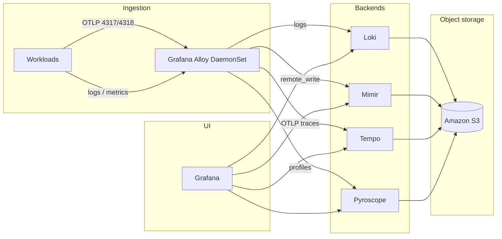

<div align="center"> 
  <h1>🚀 LGTM stack on Kubernetes Complete Hands‑On Guides 🌟 </h1>
  <a href="https://github.com/kioskOG/observability-hub"> </a>  
  <br>
    
  
  
  
  
  
  

  <!--  -->
  <a href="https://github.com/kioskOG/observability-hub/blob/main/LICENSE">  </a>
  <a href="https://github.com/kioskOG/observability-hub/graphs/contributors">  </a>
  <a href="https://github.com/kioskOG/observability-hub/issues">   </a>
  <a href="https://github.com/kioskOG/observability-hub/pulls">  </a>
  <a href="https://github.com/kioskOG/observability-hub/pulls">  </a>
  </div>

---


# Observability Hub

Helm values, Kubernetes manifests, and a **Makefile** to run a Grafana-style observability stack on Kubernetes (especially **AWS EKS**): **Loki** (logs), **Mimir** (metrics), **Tempo** (traces), **Grafana Alloy** (collection, OTLP, profiles), **Pyroscope** (continuous profiling), **kube-prometheus-stack** (Prometheus Operator, Grafana, Alertmanager), and **Blackbox Exporter**.

This repository is oriented around **repeatable installs**, **S3-backed** Loki/Mimir/Tempo/Pyroscope, **basic auth** on Loki and Mimir gateways, and **multi-tenant Loki** (`auth_enabled` + per-tenant `X-Scope-OrgID`).

---

## Architecture



---

## Repository layout

| Path | Purpose |
|------|---------|
| `Makefile` | Install order, `init`, per-component Helm installs, port-forwards, cleanup |
| `loki/` | Loki Helm overrides, IAM policy/trust examples, `.htpasswd` (not committed if you create locally) |
| `mimir/` | Mimir overrides, rules, dashboards, Prometheus remote_write secret template |
| `tempo/` | Tempo overrides, trace demo app, optional templates |
| `alloy/` | Alloy Helm overrides, `alloy-configMap.yml` (River config), `alloy-remote-credentials-secret.yaml` |
| `pyroscope/` | Pyroscope overrides, sample apps, IAM examples |
| `kube-prometheus-stack/` | Local chart / values for Prometheus Operator + Grafana |
| `blackbox-exporter/` | Blackbox values |
| `short-url-application/` | Example app with metrics + traces |
| `default-storage-class.yaml` | Example EBS `gp2-standard` StorageClass |

Pinned chart versions live in the `Makefile` (`VERSION_*` variables).

---

## `script.sh` (optional AWS bootstrap)

`make init` runs `./script.sh` first. The script can **generate** IRSA trust/policy JSON and **render** `*-override-values.yaml` from templates using your cluster name, region, and bucket names.

**It will ask before changing AWS:** whether to **provision S3 buckets and IAM** (create policies, roles, attachments) via the AWS CLI, or to **skip** all mutating calls and only write files on disk (for Terraform, CloudFormation, Console, or existing roles).

- **Interactive (default):** answer `y` to provision, or `N` (Enter) to skip.
- **Non-interactive:** set the environment variable before `make init`:
  - `export OBSERVABILITY_PROVISION_AWS=no` — no `s3 mb`, no `iam create-*` / `attach-role-policy`; you must paste existing **IRSA role ARNs** when prompted.
  - `export OBSERVABILITY_PROVISION_AWS=yes` — same behavior as answering `y` (full provisioning).

Skipping provisioning still uses **read-only** calls: `sts get-caller-identity` and `eks describe-cluster` (for OIDC issuer ID in trust policies).

After `script.sh` completes, it writes **`.observability-poc-aws.state`** (gitignored) with bucket names and region so you can tear down AWS without re-entering inputs.

### AWS POC cleanup (`cleanup-aws.sh`)

Removes the **S3 buckets** and **IAM roles/policies** this repo’s provision path creates (not Helm/Kubernetes — use `make uninstall-all` for that).

| Command | What it does |
|--------|----------------|
| `make aws-cleanup-dry-run` | Lists which buckets/roles/policies **exist** and would be deleted. Uses `.observability-poc-aws.state` if present. |
| `make aws-cleanup` | Same discovery, then you must type **`DELETE`** to proceed (or set `OBSERVABILITY_AWS_CLEANUP_CONFIRM=DELETE`). |
| `./cleanup-aws.sh --dry-run` | Prompts for names (like `script.sh`) if no state file. |
| `./cleanup-aws.sh --from-state` | Load names from `.observability-poc-aws.state`. |

Deletion order: detach all policies from the four IRSA roles, delete roles, delete customer-managed policies `LokiS3AccessPolicy`, `MimirS3AccessPolicy`, `TempoS3AccessPolicy`, `PyroscopeS3AccessPolicy`, then `aws s3 rb … --force` on each bucket.

If a policy is still attached to another role in your account, policy deletion may warn and skip — detach it manually.

---

## Prerequisites

- **Kubernetes** 1.30+ recommended; `kubectl` configured for your cluster.
- **Helm 3**.
- **AWS (EKS)** (if you use the included S3 + IRSA patterns):
  - EKS with **OIDC** provider for IRSA.
  - **S3** buckets for Loki (chunks + ruler), Mimir, Tempo, Pyroscope (names in your values files).
  - **IAM roles** annotated on service accounts (see `loki-s3-policy.json`, `*-trust-policy.json` under each component directory).
  - **EBS CSI** driver and a **StorageClass** (repo includes `default-storage-class.yaml` for `gp2-standard`).
- Local tools: `htpasswd` (Apache) for gateway basic auth files, optional `aws` CLI for IAM/S3.

---

## Quick start

1. **Clone** and **edit** Helm values for your account: S3 bucket names, AWS region, IAM role ARNs (`eks.amazonaws.com/role-arn` in values), and hostnames where relevant.

2. **Create auth material** (once per environment):
   - `loki/.htpasswd` — users for **Loki nginx gateway** (referenced by `loki-basic-auth` secret).
   - `mimir/.htpasswd` — users for **Mimir nginx gateway**.
   - Align **`alloy/alloy-remote-credentials-secret.yaml`** `loki_gateway_*` with a user/password that exists in **`loki/.htpasswd`** (Alloy uses this to push logs to `loki-gateway`).

3. **Bootstrap and install everything**:

   ```bash
   make help          # targets and multi-tenant notes
   make init          # repos, namespaces, secrets, Alloy Secret + ConfigMap
   make install       # Helm installs in dependency-friendly order
   ```

   Install order in `make install`: **Mimir** → **kube-prometheus-stack** → **Loki** → **Tempo** → **Alloy** → **Pyroscope** → **Blackbox**.

4. **Grafana**: kube-prometheus-stack provisions **Mimir**, **Loki** (see below), **Tempo**, **Pyroscope**. Port-forward or use ingress:

   ```bash
   make pf-grafana
   ```

   After changing Loki datasource tenants in `kube-prometheus-stack/prometheus-values.yaml`, run **`make install-kube-prometheus-stack`** (or your usual `helm upgrade`) so Grafana reloads provisioning.

---

## Makefile reference

| Target | Description |
|--------|-------------|
| `make init` | Helm repos, `default-storage-class`, namespaces, Mimir/Loki/canary secrets, **`apply-alloy-manifests`** |
| `make apply-alloy-manifests` | `kubectl apply` Alloy **Secret** + **ConfigMap** (re-run after editing River config or credentials) |
| `make install` | Full stack (after `init`) |
| `make install-<component>` | `loki`, `tempo`, `mimir`, `alloy`, `kube-prometheus-stack`, `pyroscope`, `blackbox` |
| `make status` / `make logs` | Cluster visibility |
| `make pf-grafana` / `make pf-prometheus` / `make pf-alloy` | Local port-forwards |
| `make template-debug-<component>` | Render Helm templates with your values |
| `make uninstall` / `make uninstall-all` / `make uninstall-cleanup` | Teardown (cleanup deletes PVCs and namespaces; use with care) |

`make install-alloy` always reapplies the Alloy Secret and ConfigMap before Helm upgrade so env vars and River config stay in sync.

---

## Multi-tenant Loki

### Do you need one Grafana datasource per namespace?

**No — not for every namespace in the cluster.** You only need coverage for **tenants you actually want to browse** (or correlate with traces).

- Each **Grafana Loki datasource** sends **one** fixed **`X-Scope-OrgID`** header per request. That header is the **Loki tenant**. One datasource ⇒ one tenant at a time.
- **Alloy** stores **pod logs** under the tenant **equal to the pod’s Kubernetes namespace** (`stage.tenant { label = "namespace" }` in `alloy/alloy-configMap.yml`). Other pipelines use fixed tenant names (see table below).

**Practical options:**

| Approach | When to use |
|----------|-------------|
| **A few provisioned datasources** | Copy the `additionalDataSources` Loki blocks in `kube-prometheus-stack/prometheus-values.yaml` (this repo ships **Loki** → `default` and **Loki (monitoring)** → `monitoring`). Add more entries for namespaces you care about often (`alloy-logs`, `kube-system`, app namespaces). Each needs a **unique `uid`**. Then **`helm upgrade`** kube-prometheus-stack. |
| **Edit in Grafana UI** | Datasources are **`editable: true`**. Open **Connections → Data sources → Loki** and change the **X-Scope-OrgID** header value when you want another tenant (no Helm change). Good for ad-hoc debugging. |
| **Don’t provision one DS per namespace** | Only add Helm entries for tenants you use regularly; use the UI for rare namespaces. |

**If Explore shows no logs:** the datasource’s **`X-Scope-OrgID` must match the tenant Alloy used** for that log stream (usually the workload namespace). Mismatch (e.g. querying `default` while logs only exist under `production`) looks like “no data” even when Loki is healthy.

### Tenant IDs Alloy uses (quick reference)

| Log source | Loki tenant (`X-Scope-OrgID`) |
|------------|-------------------------------|
| Pod container logs | Kubernetes **namespace** of the pod |
| Kubernetes events | **`k8s_namespace_name`** label (namespace of the involved object; may be `cluster` when empty) |
| Alloy internal logging | **`alloy-logs`** |
| Node syslog / journal (as configured) | **`platform`** |
| OTLP span logs → Loki | **`traces`** (see `alloy-configMap` spanlogs pipeline) |
| Loki canary | **`loki-system`** (Helm `-tenant-id`) |

### Stack behaviour (reminders)

- **Loki** uses **`auth_enabled: true`**. Every HTTP call must carry **`X-Scope-OrgID`** (except where the gateway injects a default).
- **Nginx gateway** forwards **`X-Scope-OrgID`**; if the client omits it, the map defaults to **`loki-system`** (`loki/loki-override-values.yaml` → `gateway.nginxConfig.httpSnippet`).
- **Tempo → Logs** links use the datasource **`uid: loki`** by default; that datasource queries whichever tenant you set there (e.g. `default`). For trace-to-logs into other namespaces, add another Loki datasource with the matching **`X-Scope-OrgID`** and point **Explore** or derived-field config at it if needed.

---

## Secrets and credentials (checklist)

| Secret / file | Namespace | Purpose |
|---------------|-----------|---------|
| `loki-basic-auth` from `loki/.htpasswd` | `loki` | Loki gateway basic auth |
| `canary-basic-auth` | `loki` | Loki canary push/query user/password |
| `mimir-basic-auth` from `mimir/.htpasswd` | `mimir` | Mimir gateway basic auth |
| `mimir-secret-for-prometheus.yaml` | `monitoring` | Prometheus → Mimir remote_write auth |
| `alloy-remote-credentials` | `alloy-logs` | Alloy → Loki gateway + Mimir `remote_write` basic auth |

After rotating `loki/.htpasswd`, update **`alloy/alloy-remote-credentials-secret.yaml`** and run **`make apply-alloy-manifests`**, then restart or upgrade Alloy if needed.

---

## Grafana Alloy

- **Helm values**: `alloy/alloy-override-values.yaml` (extra ports **4317/4318** OTLP, **4041** Pyroscope receive, DaemonSet, host log mounts, optional eBPF / privileged mode for profiling).
- **River config**: `alloy/alloy-configMap.yml` → ConfigMap `alloy-config`, key `config.alloy`.
- Collects **pod logs**, **Kubernetes events**, optional **node** logs, ships **OTLP** traces/metrics to Tempo/Mimir, **profiles** to Pyroscope, and **span logs** to Loki.

---

## AWS IAM and S3

Example JSON policies and trust policies live next to each stack:

- `loki/loki-s3-policy.json`, `loki/loki-trust-policy.json`
- `mimir/mimir-s3-policy.json`, `mimir/mimir-trust-policy.json`
- `tempo/tempo-s3-policy.json`, `tempo/tempo-trust-policy.json`
- `pyroscope/pyroscope-s3-policy.json`, `pyroscope/pyroscope-trust-policy.json`

Replace bucket ARNs, account ID, and OIDC issuer ID with yours. Attach the trust policy to an IAM role and set the role ARN in the corresponding Helm values (`serviceAccount.annotations`).

---

## Demo and sample applications

- `tempo/tracing-demo-app/` — Flask + OpenTelemetry.
- `pyroscope/pyroscope-app/` — Flask + Pyroscope + OTEL.
- `pyroscope/pyroscope-rideshare-go/` — Go rideshare + Pyroscope + OTEL.
- `short-url-application/` — Auth service example with Prometheus + MySQL + tracing.
- `trace-generator.yaml` — k6 trace generator Deployment (OTLP to Alloy).

---

## Testing Loki with k6

You can load-test Loki with **xk6-loki** as in the original guide: point the client at your gateway URL, use basic auth, and add header **`X-Scope-OrgID`** for the tenant you want to write into. See [Grafana Loki k6 documentation](https://grafana.com/docs/loki/latest/send-data/k6/).

---

## Values templates

`./script.sh` renders these with **restricted** `envsubst` (only specific `${VAR}` placeholders) so nginx `$variables` inside gateway configs are not stripped. If you run `envsubst` yourself, use the same allowlist as in `script.sh`.

- `loki/loki-values-template.yaml`
- `mimir/mimir-values-template.yaml`
- `tempo/tempo-values-template.yaml`
- `pyroscope/pyroscope-values-template.yaml`

---

## Troubleshooting

- **Loki (or other workloads) `AccessDenied: sts:AssumeRoleWithWebIdentity` on S3**: IRSA trust on the IAM role does not match the pod’s Kubernetes service account JWT (`sub`), or the ServiceAccount is missing `eks.amazonaws.com/role-arn`. Confirm:
  - `kubectl -n loki get pod loki-compactor-0 -o jsonpath='{.spec.serviceAccountName}{"\n"}'`
  - `kubectl -n loki get sa <that-name> -o yaml | grep role-arn`
  - IAM role trust must allow `aud` = `sts.amazonaws.com` and a `sub` that matches `system:serviceaccount:<namespace>:<serviceaccount>`. This repo’s `script.sh` now generates **StringLike** `system:serviceaccount:loki:*` (and similarly for mimir/tempo/pyroscope namespaces) so Helm SA naming drift is less brittle. **Re-apply** the trust policy: `aws iam update-assume-role-policy --role-name LokiServiceAccountRole --policy-document file://loki/loki-trust-policy.json` (after regenerating JSON with the correct OIDC issuer ID for your cluster). Helm values use an explicit **`serviceAccount.name: loki`** so the SA aligns with a strict trust if you prefer `StringEquals` on `system:serviceaccount:loki:loki` only.
- **Memberlist “unexpected node” warnings**: Often stale ring members after a StatefulSet pod restart; usually clears or resolves after a rolling restart of Loki components. Not the same as IRSA/S3 errors.

- **Alloy pods crash or 401 to Loki**: Check `alloy-remote-credentials` matches **`loki/.htpasswd`** and that `make apply-alloy-manifests` was applied.
- **Grafana Loki “no data”**: The provisioned datasource’s **X-Scope-OrgID** must match the **tenant Alloy wrote to** (usually the pod **namespace**). See **[Multi-tenant Loki](#multi-tenant-loki)**. Confirm with **`kubectl logs -n alloy-logs -l app.kubernetes.io/name=alloy`** (look for 401s to `loki-gateway`).
- **Helm upgrade errors**: Run `make template-debug-<component>` to validate rendered YAML; check chart CHANGELOG for breaking changes when bumping `VERSION_*` in the Makefile.

---

## License and upstream

License information is in [LICENSE](LICENSE) if present. This project builds on Grafana Helm charts and community documentation; chart versions are pinned in the `Makefile` for reproducibility.
