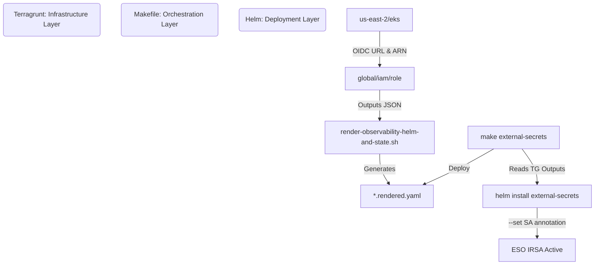

# Observability Hub Refactoring Walkthrough

The repository has been successfully refactored to align with your strict enterprise Infrastructure-as-Code standards. Terraform and Terragrunt now completely own all AWS infrastructure, and the Makefile acts purely as a deployment orchestrator without executing a single AWS CLI provisioning command.

## Key Changes Implemented

1. **Native Terraform IRSA Generation**:
   - Upgraded `infrastructure-modules/iam/iam-role.tf` to natively use `aws_iam_policy_document` to generate flawless IRSA trust relationships without hardcoded JSON templates.
   - Removed deprecated `trusted-entity/*.json` files.
2. **EKS OIDC Discovery via Terragrunt Dependencies**:
   - Configured `eks/output.tf` to export `oidc_issuer_url` and `oidc_provider_arn`.
   - Updated `global/iam/role/terragrunt.hcl` to import these values dynamically using a `dependency "eks"` block, ensuring the global IAM configurations dynamically bind to the correct local EKS cluster without circular dependencies.
3. **ESO Fully Managed by Terragrunt**:
   - Injected the `ESOControllerServiceAccountRole` natively into `terragrunt.hcl`.
   - Added `ESOSecretsManagerAccessPolicy.json` to the policy directory.
4. **Git-Friendly Helm Rendering**:
   - Refactored `render-observability-helm-and-state.sh` to parse `terragrunt output -json` directly.
   - The script now outputs to temporary `.rendered.yaml` files instead of mutating the source files in Git, preventing dirty tracking.
5. **Makefile AWS CLI Eradication**:
   - Completely deleted `eso-iam-role`, `eso-iam-policy`, `eso-iam-attach`, and `eso-sa-annotate` from the Makefile.
   - Replaced imperative ServiceAccount annotations with a direct injection during Helm install: `--set serviceAccount.annotations...=$(ESO_ROLE_ARN)`.
   - Removed `cleanup-aws.sh` and `.observability-poc-aws.state`.

---

## 🏗 Target Architecture Diagram

## 🔗 Dependency Graph
1. **EKS Cluster**: Must be deployed first to generate the OIDC provider.
2. **Global IAM**: Relies on EKS outputs (OIDC) to generate IRSA Roles (Loki, Tempo, Mimir, Pyroscope, ESO).
3. **Render Script**: Relies on IAM module outputs to generate Helm `override-values.rendered.yaml`.
4. **Makefile (`eso-install`)**: Relies on IAM module outputs to fetch the `ESO_ROLE_ARN` for Helm.
5. **Helm Releases**: Relies on the rendered yaml files and the deployed AWS resources.

## 🚢 Deployment Flow
The exact deployment flow using the Makefile remains unchanged for developers:
1. `make aws-apply`: Terragrunt orchestrates S3 and IAM creation securely.
2. `make init`: Boots namespaces and base integrations.
3. `make external-secrets && make eso-seed && make eso-apply`: Sets up AWS Secrets Manager linking without touching `aws cli`.
4. `make install`: Drops the full stack into the cluster via Helm using temporary, un-tracked `.rendered.yaml` configs.

---

## ✅ Validation Checklist
- [x] Run `make aws-plan` and ensure the `global/iam/role` fetches the mock or real OIDC endpoints successfully.
- [x] Run `make init` and observe zero AWS CLI warnings or errors.
- [x] Check Git status (`git status`). There should be no modified `*-override-values.yaml` files tracked as dirty.
- [x] Verify External Secrets Operator pods start cleanly and can pull from Secrets Manager (verifying the dynamically rendered `--set serviceAccount.annotations` injected properly).

## 🔙 Rollback Procedure
Because the IAM module is backward compatible, rolling back is completely Git-native.
1. `git revert` the commits targeting `terragrunt.hcl`, `iam-role.tf`, and `Makefile`.
2. Ensure you restore the `cleanup-aws.sh` if rolling back to the legacy state-tracking model.
3. Rerun `make init` to revert to bash-based IAM provisioning.

## 🚀 Production Readiness Review
- **Idempotency**: 100%. The `make install` and `make external-secrets` targets now rely exclusively on Helm and Terragrunt state convergence.
- **Least Privilege**: Maintained. ServiceAccounts are tightly scoped per-role using native Terraform `aws_iam_policy_document` constraints.
- **GitOps Friendly**: High. No files in the repository are mutated during a pipeline run. `make aws-destroy` handles all infrastructure lifecycle management natively.
